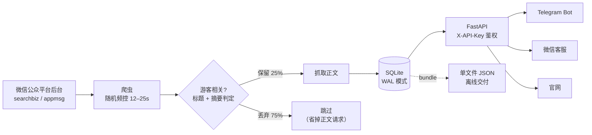

# 景点公众号出行公告采集与 API 服务

[](https://github.com/tonghaoxu/wechat-attraction-crawler/actions/workflows/ci.yml)
[](https://www.python.org/)
[](LICENSE)

把中国热门景点**官方公众号**里真正影响出行的公告——临时闭园、票价调整、索道停运、
台风预警、假期安排——从大量推广软文中筛出来，连同各景点的官方购票链接一起沉淀成结构化数据，
再通过一套只读 HTTP API 供 Telegram Bot、微信客服、官网等多个前端统一取用。

> 面向的真实场景：外国游客想知道"明天布达拉宫开不开门""漓江游船停运了吗"，
> 而这些信息只散落在各景区公众号的推文里，没有任何公开 API。

| 配置景点 | 覆盖省份 | 有效公告 | 正文抓取率 | 过滤保留率 |
|---:|---:|---:|---:|---:|
| **57** 个 | **20** 个 | **112** 篇 | **100%** | **25%**（436 → 112）|

---

## 架构



微信公众号没有公开的内容 API。本项目走的是目前最稳的路径：用**自己注册的订阅号**登录后台，
借助「图文素材 → 超链接」功能背后的两个接口搜索公众号、分页拉取历史文章列表；
正文页 `mp.weixin.qq.com/s/...` 本身是公开网页，可直接解析。

---

## 几个值得一说的设计

### 1. 过滤发生在抓正文**之前**

景区公众号里大部分推文与出行无关（文创带货、党建表彰、研学招募）。
如果先抓正文再判断，75% 的网络请求都白费——而请求正是这个项目最稀缺的资源。

所以判定只用列表接口已经返回的**标题 + 摘要**完成，放在正文请求前面
（[main.py:111](wechat_crawler/main.py#L111)）。规则是白名单模式，且**排除词优先级高于保留词**
（[filter.py:50](wechat_crawler/filter.py#L50)）：

```python
# "关于公开招聘讲解员的公告" —— 含保留词"公告"，但因含排除词"招聘"被丢弃
for kw in exclude:
    if kw in text:
        return False, f"排除词「{kw}」"
for kw in include:
    if kw in text:
        return True, f"关键词「{kw}」"
return False, "未命中游客相关关键词"
```

这个优先级顺序是词表设计的关键：反过来写的话，"文创上新预约通道开启"会因为"预约"被放行。
实测 436 篇 → 112 篇，三类核心公告（开闭园、价格、临时闭馆）几乎全部命中。

### 2. Cookie 自动续期，而不是每周手动重登

公众平台的登录态几天就过期。常见做法是把 Cookie 字符串写死进请求头，然后定期手动更新。

这里改成把 Cookie 灌进 `session.cookies` jar（[mp_client.py:66](wechat_crawler/mp_client.py#L66)），
于是服务器每次响应的 `Set-Cookie` 会被 requests 自动合并回会话；抓取结束时再把最新值写回本地
（[config.py:15](wechat_crawler/config.py#L15)）。只要保持定期抓取，登录态就能一直滚动续期。

凭证写回做了三重加固：`yaml.safe_dump` 正确转义（Cookie 里的引号会写坏手工拼接的 YAML）、
先写临时文件再原子 `os.replace`（避免中断产生半截文件）、落盘后 `chmod 0600`。

### 3. 把"被限流"当作正常状态来设计

公众平台频控很严，触发后接口返回 `ret=200013`，冻结数小时。这不是异常分支，是必然会走到的路径：

- 每次请求前强制随机休眠 12–25 秒（[mp_client.py:83](wechat_crawler/mp_client.py#L83)），随机化避免固定节奏被识别；
- `ret=200013` 转成 `FreezeError` 停止本轮抓取而非重试（[mp_client.py:105](wechat_crawler/mp_client.py#L105)），重试只会延长冻结；
- 已入库文章自动跳过 → 天然支持断点续抓，冻结后重跑即可接上；
- `finally` 块里无论成功失败都写回 Cookie，中断也不浪费这次续期。

### 4. 一行 PRAGMA 省掉一层架构

爬虫在写、API 在读，两个进程并发访问同一个 SQLite。
开启 WAL 模式（[storage.py:46](wechat_crawler/storage.py#L46)）后读写互不阻塞，
省掉了引入 PostgreSQL 或加一层缓存的必要——对这个数据量级（112 篇 / 23MB）来说完全够用。

---

## 快速开始

### 不需要凭证，先跑通全流程

```bash
pip install -e ".[dev]"
python scripts/seed_demo.py      # 灌入演示数据
python -m wechat_crawler serve   # 打开 http://localhost:8000/docs
```

`/docs` 是 FastAPI 自带的交互式接口文档，可以直接试调。
演示数据标题带「【演示】」前缀，`python scripts/seed_demo.py --remove` 可随时清除。

### 真实抓取

1. 注册**自己的**微信公众号（个人免费订阅号即可），登录 https://mp.weixin.qq.com ；
2. 地址栏 `...&token=1234567890` 里的数字，和 F12 → Network → 任意请求的 Cookie 整串，
   写进项目根目录的 `credentials.yaml`（该文件已被 `.gitignore` 排除）：

   ```yaml
   credentials:
     token: "1234567890"
     cookie: "..."
   ```

3. 抓取：

   ```bash
   python -m wechat_crawler search 微故宫   # 先核对搜到的是不是官方号
   python -m wechat_crawler crawl           # 抓取（默认最近90天、启用过滤）
   python -m wechat_crawler stats           # 查看入库统计
   ```

完整的命令参数、过滤词表配置、频控建议见 **[docs/USAGE.md](docs/USAGE.md)**。

---

## API

启动 `python -m wechat_crawler serve` 后：

| 接口 | 用途 |
|---|---|
| `GET /health` | 健康检查（无需鉴权） |
| `GET /api/accounts` | 景点列表：城市、分类、官方购票链接，支持 `?category=` `?city=` |
| `GET /api/articles` | 文章列表（分页，可按账号/时间过滤） |
| `GET /api/articles/{aid}` | 单篇详情（正文全文 + 图片） |
| `GET /api/search?q=` | 全文搜索，返回命中片段 |
| `GET /api/latest` | 各号最新文章（推送/信息流） |

`GET /api/search?q=门票&limit=1`：

```json
{
  "query": "门票",
  "items": [
    {
      "aid": "demo-微故宫-0",
      "account": "故宫博物院（微故宫）",
      "title": "【演示】故宫门票预约全攻略",
      "publish_time": "2026-07-13T12:14:49",
      "has_content": true,
      "snippet": "故宫博物院实行网上实名预约购票，请提前十天通过官方渠道预约。开放时间：旺季8:30-17:00……"
    }
  ]
}
```

鉴权用请求头 `X-API-Key`（在 `config.yaml` 的 `api.api_keys` 里为每个接入方各配一个）。
完整接口契约见 **[docs/API.md](docs/API.md)**。

不想跑服务的下游项目，可以用 `python -m wechat_crawler bundle` 打包一个自包含 JSON
（景点 + 购票信息 + 全部文章正文），直接读文件即可，不依赖本项目代码。

---

## 项目结构

```
wechat_crawler/
  config.py       配置加载 + 凭证安全写回
  mp_client.py    公众平台接口（搜号 / 拉列表 / 频控 / Cookie 续期）
  article.py      正文页抓取与解析
  filter.py       游客相关性过滤词表与判定
  storage.py      SQLite 存储 / 查询 / 导出 / 打包
  server.py       FastAPI 只读数据服务
  main.py         命令行入口
tests/            过滤规则测试（pytest）
docs/             OVERVIEW 设计概览 · API 接口文档 · USAGE 使用手册
scripts/          演示数据灌入脚本
```

设计概览与数据模型见 **[docs/OVERVIEW.md](docs/OVERVIEW.md)**。

## 测试

```bash
pytest -v
```

26 个用例覆盖过滤的三条规则、排除词优先级、自定义词表替换语义，
以及词表自身的重复/冲突检查（这项检查在初次运行时就查出了一个重复词）。

---

## 使用边界

- 本项目**只抓取公开发布的文章**，且仅使用**运行者自己注册的公众号**的登录态，
  不涉及任何账号破解、验证码绕过或他人凭证；
- 仓库**不包含任何抓取到的文章内容**——文章版权归原公众号所有，
  `data/` 已被 `.gitignore` 排除，导出的 Markdown 自带原文链接；
- 请求频率被有意压到很低（每次 12–25 秒），请勿调高；
- 仅供个人学习与技术研究，使用时请遵守微信公众平台服务协议，勿用于商业用途或大规模分发。

## License

[MIT](LICENSE) © tonghaoxu
